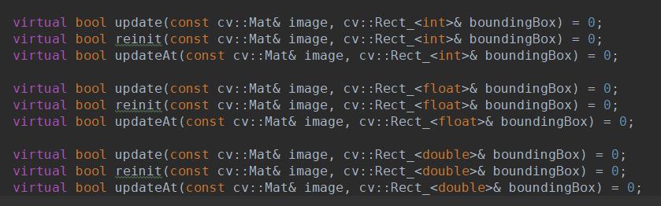

C++实现的与相关滤波相关的跟踪算法（KCF, DSST, Staple）
-----------------------------------

# 跟踪算法介绍
* KCF[[1](https://arxiv.org/abs/1404.7584 "1")]: [原始代码]( http://www.robots.ox.ac.uk/~joao/circulant/index.html "原始代码") ，核相关滤波（KCF）在CSK的基础上扩展了多通道梯度的HOG特征，并引入了核函数，把非线性问题转化为线性问题，KCF没有考虑尺度问题，检测得到的框大小固定。
* DSST[[2](http://www.bmva.org/bmvc/2014/files/paper038.pdf "2")]: [原始代码](https://github.com/gnebehay/DSST "原始代码"), 尺度估计跟踪（DSST）,在原来相关滤波的基础上，加入了尺度估计，将Tracking分成了两步，1）采用2D滤波器进行位置的检测，2）采用1D的滤波器进行尺度估计（33个尺度）。DSST是VOT2014竞赛的冠军，开创了平移滤波+尺度滤波。该方法的作者（Martin Danelljan）后续也提出了各种state-of-the-art的方法如：fDSST, C-COT, SRDCF, DeepSRDCF, SRDCFdecon, C-COT, ECO，将相关滤波用到了极致。
* Staple[[3](https://arxiv.org/abs/1512.01355 "3")] : [原始代码](https://github.com/bertinetto/staple "原始代码")，最大的创新就是把模板特征方法DSST(基于DCF)和统计特征方法DAT结合，克服了Hog特征对形变敏感的缺陷，同时相关滤波对于快速运动的物体容易产生边缘效应，而DAT方法用贝叶斯方法对前景和背景建模，独立于相关滤波，两种方法相互补充，在采用更小的分辨率的HOG情况下，提升了计算速度和跟踪准确性，Staple在VOT 2016竞赛中排名第5，是唯一一个官方推荐的实时算法（~80fps CPU），也是目前最新的一些深度学习的方法也都会与其进行对比。

# 编译要求
* OpenCV >= 3.0
* C++ 11
* cmake

# 源码目录说明
## 1. `src/3rdparty ` 算法中使用到的第三方包
### 1.1 `src/3rdparty/cv_ext`
主要用于获取初始化框，计算归一化的响应值，以及在频率域内进行加法出发以及求和操作
### 1.2 `src/3rdparty/piotr`
主要用于计算Hog特征，使用OpenCV来接口实现 Piotr's包[ Hog特征](https://github.com/pdollar/toolbox/blob/612f9a0451a6abbe2a64768c9e6654692929102e/channels/private/gradientMex.cpp " Hog特征")的计算。
### 1.3 `src/3rdparty/tclap`
主要用于命令行的参数解析。
## 2. `src/cf_lib` 不同Tracking算法的实现以
### 2.1` src/cf_lib/common`
不同tracking算法公共的一些操作，如尺度估计，特征矩阵的乘，加,求和等。
* cf_tracker 抽象接口类，之后实现的tracking算法都继承这个类。提供如下操作接口：
[](http://git.code.oa.com/XLabTracking/cf_tracking_public/blob/master/images/cf_tracker.png "cf_tracker")
	* reinit 提供初始位置，根据从而初始化跟踪器，再对模型进行初次训练；
	* update 首先更新物体框的位置，返回给boundingBox，再根据新的位置对模型进行更新（这里都是逐帧更新）；
	* updateAt  重新选取物体所在框的位置，根据当前框的位置更新模型（此时不用重新训练）。
* scale_estimator 尺度估计模块，包含初始化函数（reinit），尺度更新函数（detectScale）,模型更新函数（updateScale）
主要参数：
`scaleCellSize`： 计算Hog特征时单cell的大小，最后得到的特征维度为图像维度除以此值；
`scaleModelMaxArea`: 搜索区域归一化后的大小（长*宽）;
`scaleStep`: 缩放尺度的步长，不同的尺度乘以不同个数的scalestep;
`numOfScales`: 尺度个数
`learningRate`: 估计尺度的模型的学习率

### 2.2 `src/cf_lib/`
kcf, dsst, staple不同模块的实现。除了kcf不带scale，其他两个算法都需要额外设置上面的scale参数。共同的主要参数如下：
`padding`：扩展当前框的搜索范围（1+padding）*size
`templateSize`: 归一化后搜索框的大小
`learningRate`:估计位置的模型的学习率，（与上面估计尺度的模型的学习率区别）
`enableScaleEstimator`:是否调用scale进行尺度估计
对于stape，还有一些其他主要参数：
`enableColourTracker`:是否调用颜色模型进行融合
`n_bins`:计算颜色直方图特征时bin的数目
`learning_rate_pwp`:颜色模型的学习率
`inner_paddding`: 前景的离target的裁剪范围
`merge_factor`:颜色模型与相关滤波的方法进行混合时的颜色模型所占的比例

## 3. `src/main` 不同Tracking算法的主函数（供测试）
`tracker_run/tracker_run`: （1）于配置非模型参数，输入格式（视频，摄像头，图片序列，默认调用摄像头），跟踪结果存储的路径，输入视频/图片序列的路径，摄像头设备ID等参数。
（2）对不同的tracker算法进行算调用，调用`start`函数开始循环，对模型进行初始化，以及更新，同时处理用户输入（r:重新选取初始框对模型进行初始化，t:选取当前框更新模型，p：暂停/开始，c:逐帧计算，Esc:退出）。
`track_run/image_acquisition`：将视频、图片、摄像头的不同数据来源进行封装，提供统一对外接口（打开文件，释放文件，重载读取图片>>等）。
`main_dsst, main_kcf, main_staple`: 不同trackering算法的主函数，主要用于模型参数初始化（与上面的外参要区别开）。以及实例化traker_run, 调用不同跟踪函数。

# 参考文献
[1]
```
@article{henriques2015tracking,
title = {High-Speed Tracking with Kernelized Correlation Filters},
author = {Henriques, J. F. and Caseiro, R. and Martins, P. and Batista, J.},
journal = {Pattern Analysis and Machine Intelligence, IEEE Transactions on},
year = {2015}
```
[2]
```
@inproceedings{danelljan2014dsst,
title={Accurate Scale Estimation for Robust Visual Tracking},
author={Danelljan, Martin and H{\"a}ger, Gustav and Khan, Fahad Shahbaz and Felsberg, Michael},
booktitle={Proceedings of the British Machine Vision Conference BMVC},
year={2014}}
```
[3]
```
@article{bertinetto2015staple,
  title={Staple: Complementary Learners for Real-Time Tracking},
  author={Bertinetto, Luca and Valmadre, Jack and Golodetz, Stuart and Miksik, Ondrej and Torr, Philip},
  journal={arXiv preprint arXiv:1512.01355},
  year={2015}
}
```